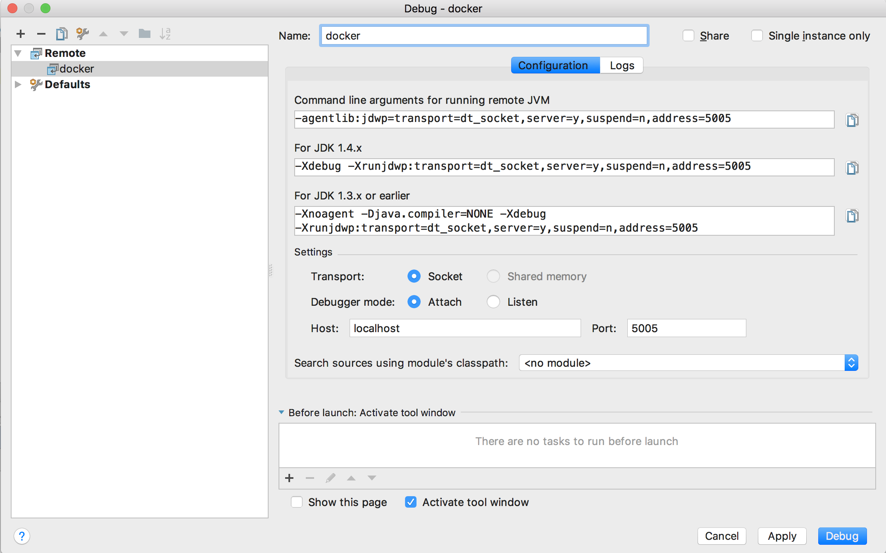
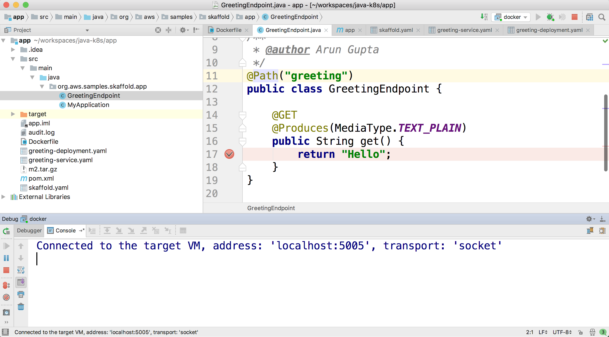
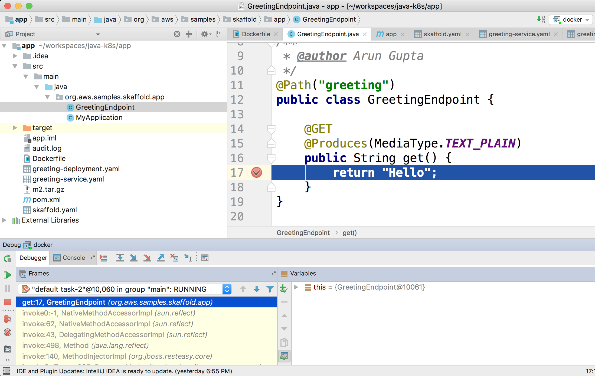
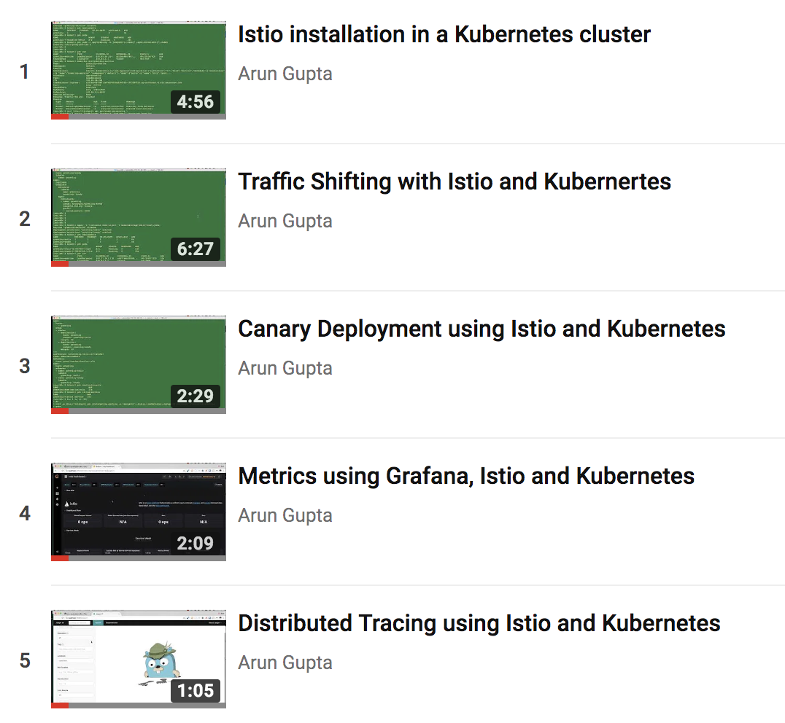
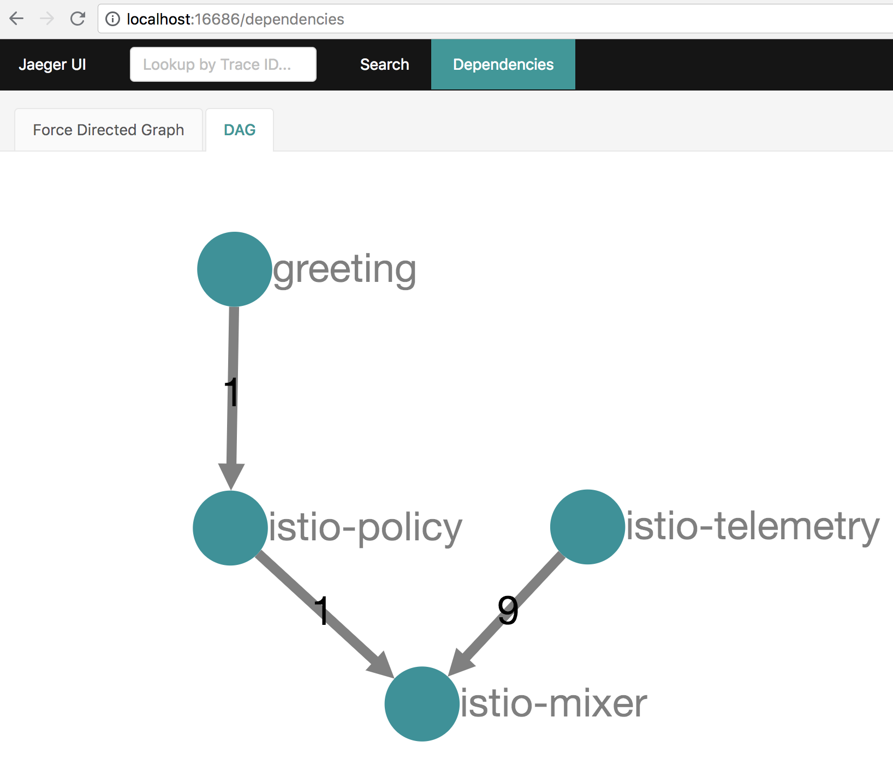
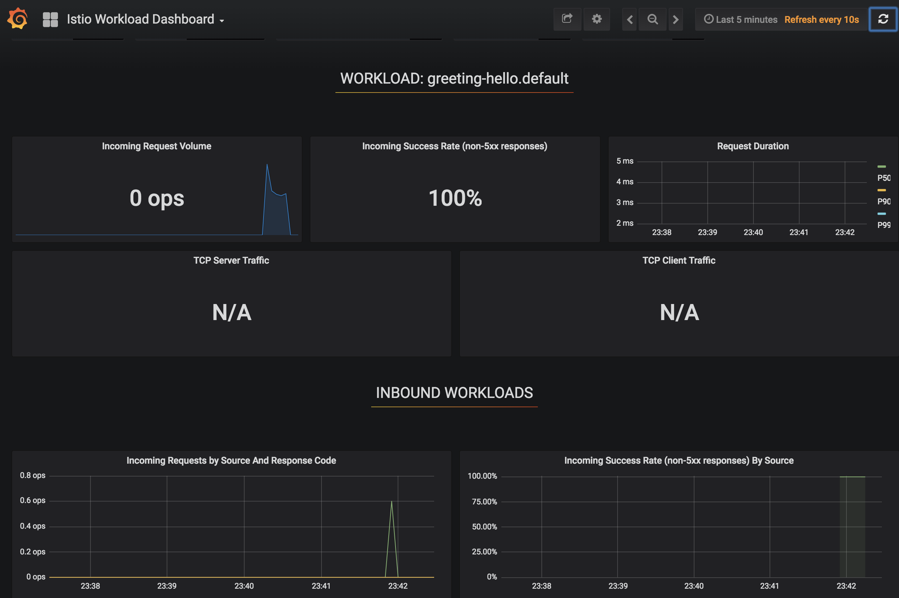

= A Day in Java Developer's Life, with a taste of Kubernetes
:toc:

Deploying your Java application in a Kubernetes cluster could feel like Alice in Wonderland. You keep going down the rabbit hole and don't know how to make that ride comfortable. This repository explains how a Java application can be deployed, tested, debugged and monitored in Kubernetes. In addition, it also talks about canary deployment and deployment pipeline.

== Application

We will use a simple Java application built using https://thorntail.io/[Thorntail] (nee WildFly Swarm). The application publishes a REST endpoint that can be invoked at `http://{host}:{port}/resources/greeting`.

The source code is in the `app` directory.

== Build and Test using Maven

. Run application:

	cd app
	mvn wildfly-swarm:run

. Test application

	curl http://localhost:8080/resources/greeting

== Build and Test using Docker

. Create Docker image:

	docker image build -t arungupta/greeting .

. Run container:

	docker container run --name greeting -p 8080:8080 -p 5005:5005 -d arungupta/greeting

. Access application:

	curl http://localhost:8080/resources/greeting

. Remove container:

	docker container rm -f greeting

== Build and Test using Kubernetes

Kubernetes can be easily enabled on a development machine using Docker for Mac as explained at https://docs.docker.com/docker-for-mac/#kubernetes.

. Configure kubectl CLI for Kubernetes cluster

	kubectl config use-context docker-for-desktop

. Install the Helm CLI:
+
	brew install kubernetes-helm
+
If Helm CLI is already installed then use `brew upgrade kubernetes-helm`.
+
. Install Helm in Kubernetes cluster:
+
	helm init
+
If Helm has already been initialized on the cluster, then you may have to upgrade Tiller:
+
	helm init --upgrade
+
. Install the Helm chart:

	helm install --name myapp manifests/myapp

. Access the application:

  curl http://$(kubectl get svc/greeting-service \
  	-o jsonpath='{.status.loadBalancer.ingress[0].hostname}')/resources/greeting

. Delete the Helm chart:

	helm delete --purge myapp

== Debug Docker and Kubernetes using IntelliJ

You can debug a Docker container and a Kubernetes Pod if they're running locally on your machine. This was tested using Docker for Mac.

. Run container:

	docker container run --name greeting -p 8080:8080 -p 5005:5005 -d arungupta/greeting

. Check container:

	$ docker container ls -a
	CONTAINER ID        IMAGE                COMMAND                  CREATED             STATUS              PORTS                                            NAMES
	724313157e3c        arungupta/greeting   "java -jar app-swarm…"   3 seconds ago       Up 2 seconds        0.0.0.0:5005->5005/tcp, 0.0.0.0:8080->8080/tcp   greeting

. `Run`, `Debug`, `Remote`:
+

+
. Click on `Debug`, setup a breakpoint in the class:
+

+
. Access the application using `curl http://localhost:8080/resources/greeting` to hit the breakpoint:
+

== Kubernetes Cluster on AWS

=== EKS

https://docs.aws.amazon.com/eks/latest/userguide/getting-started.html

=== kops

https://github.com/kubernetes/kops[kops] is a commmunity-supported way to get a Kubernetes cluster up and running on AWS.

. Set AZs:

	export AWS_AVAILABILITY_ZONES="$(aws ec2 describe-availability-zones \
		--query 'AvailabilityZones[].ZoneName' \
		--output text | \
		awk -v OFS="," '$1=$1')"

. Set state store: `export KOPS_STATE_STORE=s3://kubernetes-aws-io`
. Create cluster:

	kops create cluster \
		--zones ${AWS_AVAILABILITY_ZONES} \
		--master-count 1 \
		--master-size m4.xlarge \
		--node-count 3 \
		--node-size m4.2xlarge \
		--name cluster.k8s.local \
		--yes

== Migrate from Dev to Prod

. Get the list of configs:

	$ kubectl config get-contexts
	CURRENT   NAME                 CLUSTER                      AUTHINFO             NAMESPACE
	          aws                  kubernetes                   aws                  
	          cluster.k8s.local    cluster.k8s.local            cluster.k8s.local    
	*         docker-for-desktop   docker-for-desktop-cluster   docker-for-desktop   

. Change the context:

    kubectl config use-context cluster.k8s.local

. Get updated list of configs:

	$ kubectl config get-contexts
	CURRENT   NAME                 CLUSTER                      AUTHINFO             NAMESPACE
	          aws                  kubernetes                   aws                  
	*         cluster.k8s.local    cluster.k8s.local            cluster.k8s.local    
	          docker-for-desktop   docker-for-desktop-cluster   docker-for-desktop

. Redeploy the application

== Istio

https://istio.io/[Istio] is is a layer 4/7 proxy that routes and load balances traffic over HTTP, WebSocket, HTTP/2, gRPC and supports application protocols such as MongoDB and Redis. Istio uses the Envoy proxy to manage all inbound/outbound traffic in the service mesh.

Istio has a wide variety of traffic management features that live outside the application code, such as A/B testing, phased/canary rollouts, failure recovery, circuit breaker, layer 7 routing and policy enforcement (all provided by the Envoy proxy). Istio also supports ACLs, rate limits, quotas, authentication, request tracing and telemetry collection using its Mixer component. The goal of the Istio project is to support traffic management and security of microservices without requiring any changes to the application; it does this by injecting a sidecar into your pod that handles all network communications.

The following sections are also explained in the playlist:

=== Install and Configure

. Enable admission controllers as explained at https://istio.io/docs/setup/kubernetes/quick-start/#aws-w-kops. Rolling update the cluster to enable admission controllers.
+
Alternatively, create the cluster without `--yes`, edit the cluster to enable admission controllers, and then update the cluster using `kops update cluster --name cluster.k8s.local --yes`.
+
. Install and configure:

	curl -L https://github.com/istio/istio/releases/download/0.8.0/istio-0.8.0-osx.tar.gz | tar xzvf -
	cd istio-0.8.0
	export PATH=$PWD/bin:$PATH
	kubectl apply -f install/kubernetes/istio-demo.yaml

. Verify:

	kubectl get pods -n istio-system
	NAME                                        READY     STATUS      RESTARTS   AGE
	grafana-cd99bf478-59qmx                     1/1       Running     0          4m
	istio-citadel-ff5696f6f-zkpzt               1/1       Running     0          4m
	istio-cleanup-old-ca-6nmrg                  0/1       Completed   0          4m
	istio-egressgateway-58d98d898c-bjd4f        1/1       Running     0          4m
	istio-ingressgateway-6bc7c7c4bc-sc7s6       1/1       Running     0          4m
	istio-mixer-post-install-g67rd              0/1       Completed   0          4m
	istio-pilot-6c5c6b586c-nfwt9                2/2       Running     0          4m
	istio-policy-5c7fbb4b9f-f2xtn               2/2       Running     0          4m
	istio-sidecar-injector-dbd67c88d-j8882      1/1       Running     0          4m
	istio-statsd-prom-bridge-6dbb7dcc7f-ms846   1/1       Running     0          4m
	istio-telemetry-54b5bf4847-nlqjx            2/2       Running     0          4m
	istio-tracing-67dbb5b89f-9zd5j              1/1       Running     0          4m
	prometheus-586d95b8d9-mz9bm                 1/1       Running     0          4m
	servicegraph-6d86dfc6cb-tbwwt               1/1       Running     0          4m

. Deploy pod with sidecar:

	kubectl apply -f <(istioctl kube-inject -f manifests/app.yaml)

. Check pods and note that it has two containers (one for application and one for sidecar):

	kubectl get pods
	NAME                        READY     STATUS    RESTARTS   AGE
	greeting-5ff78ddc8b-pbb4z   2/2       Running   0          1m

. Get list of containers in the pod:

	kubectl get pods -l app=greeting -o jsonpath={.items[*].spec.containers[*].name}
	greeting istio-proxy

. Get response:

  curl http://$(kubectl get svc/greeting-service \
  	-o jsonpath='{.status.loadBalancer.ingress[0].hostname}')/resources/greeting

=== Traffic Shifting

. Deploy application with two versions of `greeting`, one that returns `Hello` and another that returns `Howdy`:

  kubectl delete -f manifests/app.yaml
  kubectl apply -f <(istioctl kube-inject -f manifests/app-hello-howdy.yaml)

. Access application multipe times to see different response:

  for i in {1..10}
  do
  	curl -q http://$(kubectl get svc/greeting-service -o jsonpath='{.status.loadBalancer.ingress[0].hostname}')/resources/greeting
  	echo
  done
  
. Setup an Istio rule to split traffic between 75% to `Hello` and 25% to `Howdy` version of the `greeting` service:

  kubectl apply -f manifests/greeting-rule-75-25.yaml

. Invoke the service again to see the traffic split between two services.

=== Canary Deployment

. Setup an Istio rule to divert 10% traffic to canary:

  kubectl delete -f manifests/greeting-rule-75-25.yaml
  kubectl apply -f manifests/greeting-canary.yaml

. Access application multipe times to see ~10% greeting messages with `Howdy`:

  for i in {1..50}
  do
  	curl -q http://$(kubectl get svc/greeting-service -o jsonpath='{.status.loadBalancer.ingress[0].hostname}')/resources/greeting
  	echo
  done

=== Distributed Tracing

Istio is deployed as a sidecar proxy into each of your pods; this means it can see and monitor all the traffic flows between your microservices and generate a graphical representation of your mesh traffic. We’ll use the application you deployed in the previous step to demonstrate this.

Setup access to the tracing dashboard URL using port-forwarding:

	kubectl port-forward \
		-n istio-system \
		$(kubectl get pod \
			-n istio-system \
			-l app=jaeger \
			-o jsonpath='{.items[0].metadata.name}') 16686:16686 &

Access the dashboard at http://localhost:16686.

=== Metrics using Grafana

. Install the Grafana add-on:

	kubectl apply -f install/kubernetes/addons/grafana.yaml

. Verify:

        kubectl get pods -l app=grafana -n istio-system
        NAME                       READY     STATUS    RESTARTS   AGE
        grafana-6bb556d859-v5tzt   1/1       Running   0          1m

. Forward Istio dashboard using Grafana UI:

	kubectl -n istio-system \
		port-forward $(kubectl -n istio-system \
			get pod -l app=grafana \
			-o jsonpath='{.items[0].metadata.name}') 3000:3000 &

. View Istio dashboard http://localhost:3000/d/1/istio-dashboard?

. Invoke the endpoint:

	curl http://$(kubectl get svc/greeting-service -o jsonpath='{.status.loadBalancer.ingress[0].hostname}')/resources/greeting

=== Timeouts

Delays and timeouts can be injected in services:

. Add a 5 seconds delay to calls to the service:

    kubectl apply -f manifests/greeting-delay.yaml

. Invoke the service using a 2 seconds timeout:

    curl --connect-timeout 2 http://$(kubectl get svc/greeting-service -o jsonpath='{.status.loadBalancer.ingress[0].hostname}')/resources/greeting

== Chaos using kube-monkey

https://github.com/asobti/kube-monkey[kube-monkey] is an implementation of Netflix's Chaos Monkey for Kubernetes clusters. It randomly deletes Kubernetes pods in the cluster encouraging and validating the development of failure-resilient services.

. Create kube-monkey configuration:

	kubectl apply -f manifests/kube-monkey-configmap.yaml 

. Run kube-monkey:

	kubectl apply -f manifests/kube-monkey-deployment.yaml

. Deploy an app that opts-in for pod deletion:

	kubectl apply -f manifests/app-kube-monkey.yaml

This application agrees to kill up to 40% of pods. The schedule of deletion is defined by kube-monkey configuration and is defined to be between 10am and 4pm on weekdays.

== Deployment Pipeline

https://github.com/GoogleContainerTools/skaffold[Skaffold] is a command line utility that facilitates continuous development for Kubernetes applications. With Skaffold, you can iterate on your application source code locally then deploy it to a remote Kubernetes cluster.

. Download Skaffold:

	curl -Lo skaffold https://storage.googleapis.com/skaffold/releases/latest/skaffold-darwin-amd64 \
		&& chmod +x skaffold

. Run Skaffold in the application directory:

    cd app
    skaffold dev

. Access the service:

    curl http://$(kubectl \
    	get svc/skaffold-greeting-service \
    	-o jsonpath='{.status.loadBalancer.ingress[0].hostname}')

